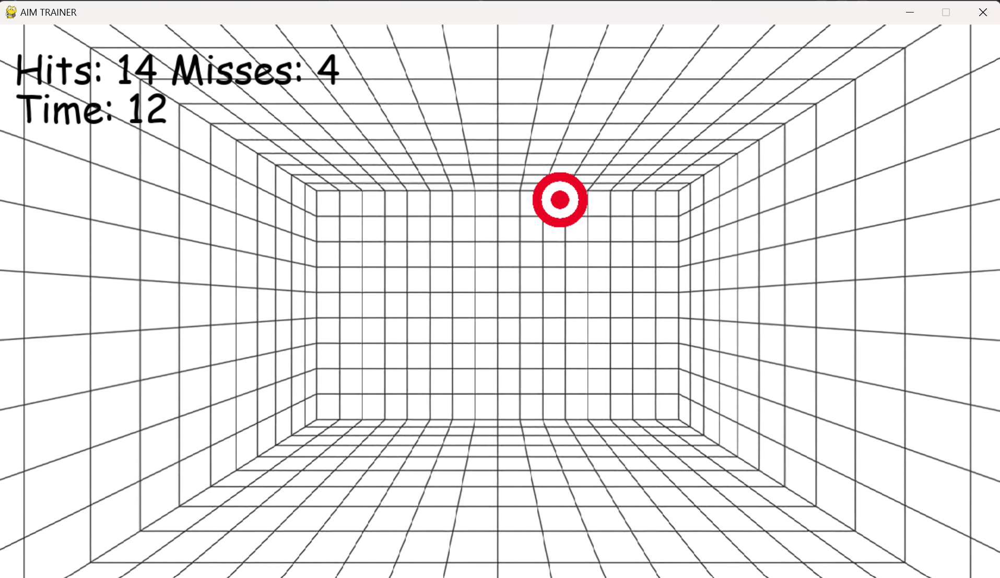
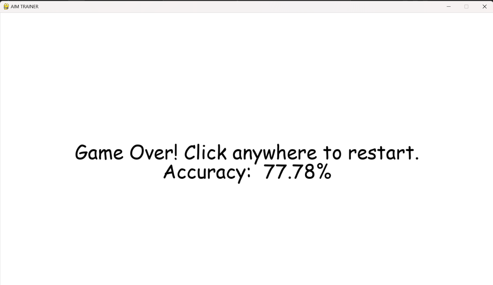
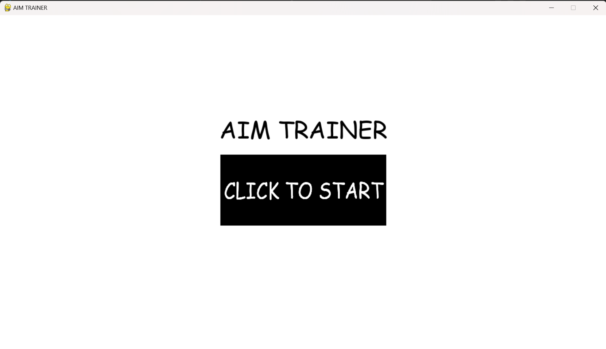

:warning: Everything between << >> needs to be replaced (remove << >> after replacing)

# AIM TRAINER
## CS110 Final Project  Fall, 2024

## Team Members

Ashley Pham

## Project Description

The game "AIM TRAINER" is a game that tests your aim and speed. It counts how many hits and misses you have when attempting to click on the targets and calculates your accuracy. Get the highest accuracy that you can by hitting as many targets as possible within the time limit.

Targets will appear randomly, varying in size and position, challenging your precision and reaction time. The interface is simple, with a start screen, main game, and ending screen telling you your statistics.

## GUI Design

### Initial Design

### Final Design

## Program Design

### Features

1. Start menu
2. Randomized targets
3. Game over screen
4. Percentage Accuracy tracker
5. Buttons to begin the game

### Classes

- Button Class: Placed in the start menu for the user to click and begin the game.
- Score Class: Keeps track of how many hits and misses there are, while actively finding the users accuracy percentage.
- Target Class: Draws image of target for the user to click on.
- Timer Class: Countdown of seconds before the game ends. 

## ATP

| Step                 |Procedure             |Expected Results                   |
|----------------------|:--------------------:|----------------------------------:|
|  1 Randomization of Target Placement. | Open the program and click the CLICK TO START BUTTON. Observe the placement of the target and its size. Quit the game and restart the game multiple times. Observe the new targets size and placement. | The targets spawned will be randomzied.  |
|  2. Assess the counter 'HIT' functionality. | Open the program and click the CLICK TO START button. Click on one red target that spawned randomly. | The top left counter that says "HITS" would go from 0 to 1. |
| 3. Assess the counter 'MISS' functionality. | Open the program and click the CLICK TO START button. Click on an area that the target has not spawned at. | The top left counter that says "MISSES" would go from 0 to 1. |
| 4. Functionality of Accuracy. | Open the program and click the CLICK TO START button. Click on 5 red targets and click on the screen 3 times to register 3 misses. Observe the end screen with the accuracy percentage. | The accuracy percentage should show 62.50% |
| 5. Running Program with all windows. | Open the program. Observe the start screen. Click the CLICK TO START BUTTON. Play the game and observe the functionality of the screen and its functions. Wait until the game is over. Observe the end screen with its accuracy button. Click the screen again and observe whether the end screen loops back to the start screen. | All screens should appear and transition to the next ones when prompted to. 
