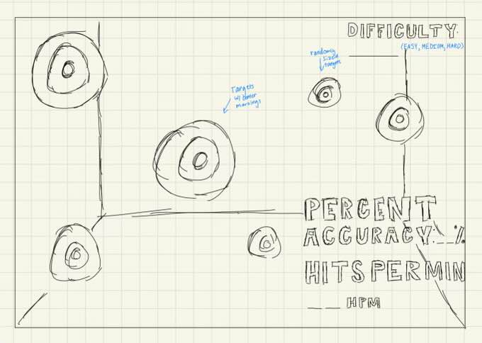

:warning: Everything between << >> needs to be replaced (remove << >> after replacing)

# << Project Title >>
## CS110 Final Project  << Semester, Year >>
/
## Team Members

<< List team member names >>

Ashley Pham

## Project Description

<< Give an overview of your project >>

A aim training game where users can get a percentage on how much in the center they clicked the target, and how off center they were. 

## GUI Design

### Initial Design

### Final Design

## Program Design

### Features

1. Start menu
2. Randomized targets with different colors from the center to the outer rim
3. Game over screen
4. Percentage and speed tracker
5. Difficulty level

### Classes

- << You should have a list of each of your classes with a description >>

## ATP

| Step                 |Procedure             |Expected Results                   |
|----------------------|:--------------------:|----------------------------------:|
|  1                   | Run Counter Program  |GUI window appears with count = 0  |
|  2                   | click count button   | display changes to count = 1      |
etc...
